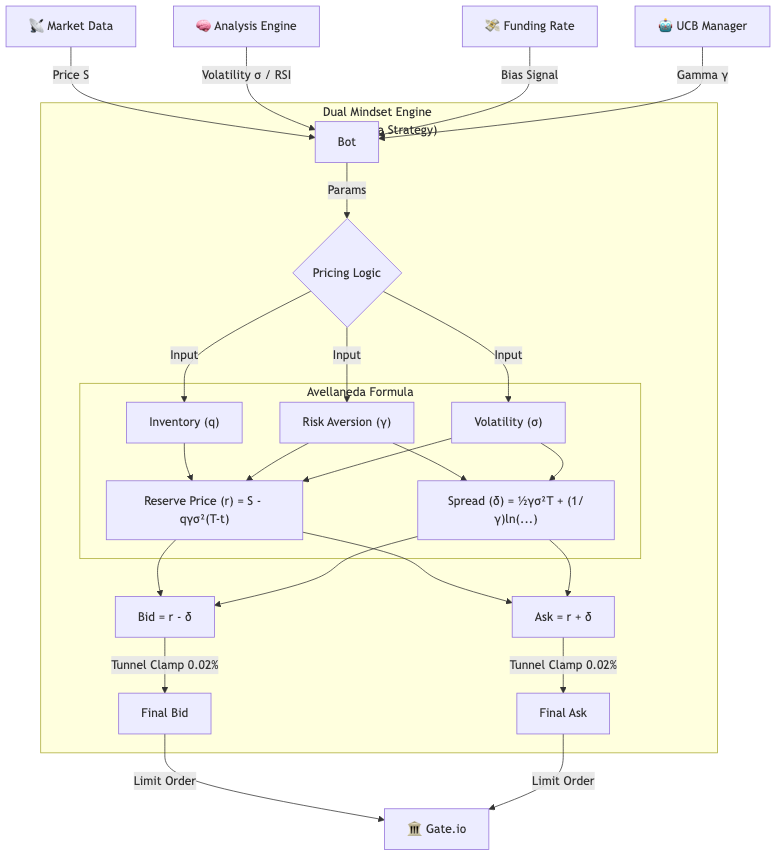

# Avellaneda-Stoikov GLFT Hedge Bot (AS-Hedge)

這是一個集成了 **GLFT 庫存控制**、**強化學習 (UCB)** 與 **資金費率對沖** 的高頻做市機器人。
專為 **Gate.io 永續合約** 設計，旨在實現「買一賣一」的極速流動性循環與市場中性收益。

---

## 🌟 8大核心策略 (The 8 Pillars)

本策略嚴格遵循以下 8 大量化規則：

1.  **AS 網格 (Avellaneda-Stoikov)**: 基於經典做市模型，動態計算最優買賣報價。
2.  **買一賣一 (Buy One, Sell One)**:
    *   **GLFT 庫存控制**: 高風險厭惡 (`Gamma=0.8`)。一旦持有庫存，報價將指數級偏離以強迫平倉，絕不長期囤貨。
3.  **跟隨趨勢 (Trend Following)**:
    *   引入 `Trend Alpha` (5m K線斜率)，在趨勢發動時自動偏斜網格中樞。
4.  **多空對沖 (Dual Mindset Hedge)**:
    *   **平行大腦**: 長線 (Long) 與 短線 (Short) 邏輯分開獨立運行 (`asyncio.gather`)，互不干擾。
5.  **FR 偏向 (Funding Rate Bias)**:
    *   **5x 強力偏向**: 若 FR > 0 (做多付費)，機器人將「做空」視為獲利目標，積極拋售直到達到目標空單量。
6.  **GLFT 數學模型**:
    *   嚴格執行 $r(s,t) = s + \alpha - q \gamma \sigma^2 (T-t)$ 公式，精確管理庫存風險。
7.  **領先指標 (Leading Indicators)**:
    *   **RSI**: 利用相對強弱指標 (RSI-14) 預判超買超賣，提前調整網格位置。
8.  **UCB 參數優化 (Reinforcement Learning)**:
    *   **自我進化**: 內建 UCB1 算法 (`uscb_manager.py`)，每 5 分鐘根據 PnL 自動搜索最佳的 `Gamma` 參數。

---

## 📊 系統流程圖 (System Workflow)



---

## ⚙️ 當前配置: 極速超短線 (HF Scalping)

為了捕捉微小利潤並實現高頻換手，目前參數設定為：

*   **Gamma (風險厭惡)**: `0.8` (極高，對庫存零容忍)
*   **TP Spread (止盈)**: `0.04%` (4 ticks，極速獲利)
*   **Layer Spread (網格)**: `0.03%` (加密掛單密度)
*   **Tunnel (鉗制)**: `0.02%` (首單貼死盤口)

這種配置下，機器人會瘋狂進行「**微利套利 (Scalping)**」，而非波段持有。

---

## 🚀 啟動方式

1. **安裝依賴**:
   ```bash
   pip install ccxt websockets python-dotenv numpy pandas
   ```

2. **配置 .env**:
   ```env
   GATEIO_TESTNET_KEY=YOUR_KEY
   GATEIO_TESTNET_SECRET=YOUR_SECRET
   ```

3. **運行**:
   ```bash
   # 啟動時會自動撤銷所有舊掛單 (Startup Clean)
   uv run avellaneda_bot.py
   ```

---

## 📂 檔案結構

*   `avellaneda_bot.py`: **[主程式]** 包含 8 大策略邏輯與雙重思維引擎。
*   `avellaneda_utils.py`: **[計算核心]** 負責 Sigma, RSI, Alpha 計算。
*   `ucb_manager.py`: **[AI 大腦]** UCB 強化學習模組。
*   `bot.py`: **[底層]** Gate.io API 接口。

---

**風險提示**: 本策略交易頻率極高，請務必關注手續費率 (Maker Fee) 與 API 限頻。
